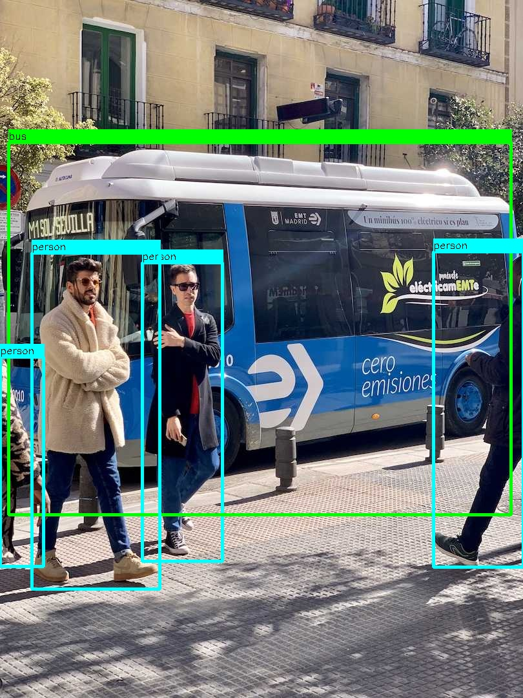

# YOLOv5 Inference C++

***This example demonstrates how to perform inference using YOLOv5 models in C++ with OpenCV's DNN API.***

## Usage
### Clone the repository
```bash
git clone https://github.com/matin-ghorbani/Yolov5-CPP.git
```

### Copy the onnx models in the models directory
*First you need to download the `weight` that you want from [here](https://github.com/ultralytics/yolov5#pretrained-checkpoints)*

*Then you need to convert the `.pt` format to `.onnx` format
To export YOLOv5 models:*

First install `ultralytics`
```bash
pip install ultralytics
```
Then clone the ultralytics repository and convert the `.pt` format to `.onnx` format with this command:
```bash
git clone https://github.com/ultralytics/yolov5.git
cd yolov5
python3 export.py --weights YOUR_WEIGHT.pt --img 480 640 --include onnx --opset 12
```
Finally, Copy the `YOUR_WEIGHT.onnx` file to `assets/models` directory.

### Go to the repository directory and make a build directory
```bash
cd Yolov5-CPP/
mkdir build
cd build/
```
### Config CMake
```bash
cmake ..
```
### Build
```bash
make
```

### Run and detect:
- On Image: ```./run YOUR_IMG.JPG```
- On Video: ```./run YOUR_VIDEO.MP4```
- On Webcam: ```./run YOUR_WEBCAM_ID```

### Result


*Note that the example networks are exported with rectangular (640x480) resolutions*
